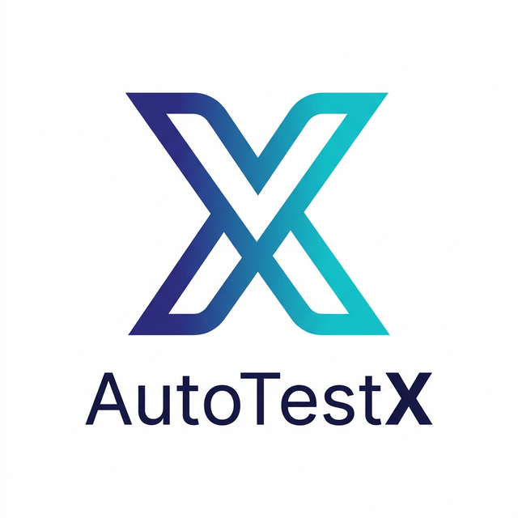

<div align="center">
  
  <h1>AutoTestX</h1>
  <p><strong>极简主义 · 大模型驱动 · 重新定义 UI 自动化测试</strong></p>
  <p>
    
    
    
  </p>
</div>

---

## 🎯 核心愿景 (Core Vision)

**AutoTestX** 的诞生旨在重塑测试行业的格局。我们不仅仅是在做一个工具，而是在推动一场关于“效率”与“专业化”的变革：

> [!IMPORTANT]
> **赋能守旧者**：让那些只会手工“点点点”的基础测试人员，通过自然语言描述，瞬间拥有构建复杂自动化测试的能力。工具不再是门槛，业务逻辑才是核心。

> [!WARNING]
> **重塑中间层**：我们希望淘汰那些“只会照猫画虎写几行测试脚本、但不精通真正开发技能”的中间层测试。AutoTestX 的 AI 能力将完全覆盖这部分低效的脚本维护工作。

> [!TIP]
> **致敬开发者**：迫使测试人员从低质量的脚本编写中解脱出来，转向真正的“测试开发 (SDET)”。去研究更底层的测试基座、去开发更有价值的测试工具，回归工程化本质。

---

## 🚀 核心特性

| 特性 | 描述 |
| :--- | :--- |
| **用例可视化管理** | 瀑布流式管理测试套件，支持添加、编辑、删除及断言定义。 |
| **自然语言驱动** | 基于 [qa-use](https://github.com/browser-use/qa-use)，AI Agent 实时操控浏览器，所见即所得。 |
| **智能定时任务** | 内置 Cron 引擎，支持标准表达式，自动化回归任务 7x24 小时待命。 |
| **深度测试报告** | 每一个动作、每一个历史、每一段耗时，完整链路清晰可循。 |

---

## 🛠️ 快速上手

### 1. 初始化环境
```bash
git clone https://github.com/YourUsername/AutoTestX.git
cd AutoTestX
pnpm run init
```
> *`init` 脚本会自动配置 Node 依赖及 Python `uv` 运行时。*

### 2. 启动开发模式
```bash
pnpm dev
```

### 3. 配置模型
启动后导航至 **“模型设置”** 模块，填入您的 OpenAI 或 Claude API Key。

---

## 🤝 特别鸣谢 (Acknowledgements)

AutoTestX 的卓越体验离不开以下开源先锋的启发：

- **[ValueCell-ai/ClawX](https://github.com/ValueCell-ai/ClawX)**: 提供了优雅的 Electron + React 19 架构模板。
- **[openclaw/openclaw](https://github.com/openclaw/openclaw)**: 卓越的 Agent 运行时与调度范式。
- **[browser-use/qa-use](https://github.com/browser-use/qa-use)**: 自动化能力的核心大脑。

---

## 📄 开源协议 (License)

AutoTestX 基于 [MIT 许可证](LICENSE) 发布。您可以自由地使用、修改和分发本软件。

---

<div align="center">
  <sub>测试未来，始于语言。打造测试人的“超级管家”。</sub>
</div>
